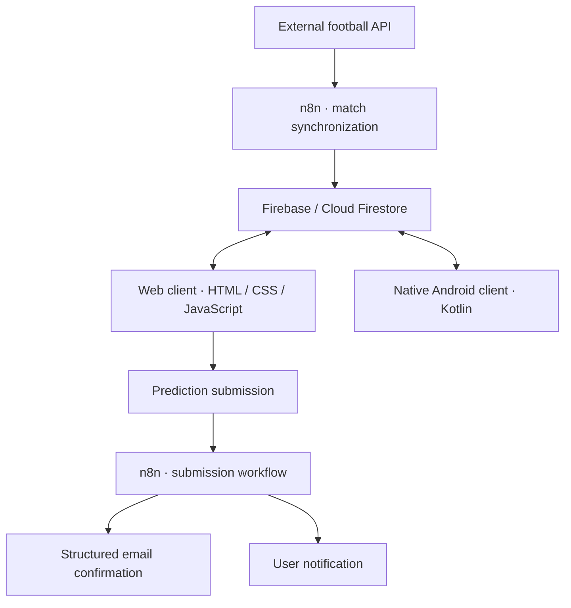

# ⚽ Quiniela Malenka 2026 · Web

<p align="center">
  
</p>

<p align="center">
  <strong>Responsive web prediction platform for the 2026 World Cup.</strong><br>
  Create predictions, follow every tournament stage, compare rankings and unlock achievements.
</p>

<p align="center">
  
  
  
  
</p>

<p align="center">
  <strong>Web client (this repository)</strong>
  &nbsp;·&nbsp;
  <a href="https://github.com/Raulgarlem/QuinielaMalenkaAndroidApp">Native Android client</a>
</p>

## The project

Quiniela Malenka transforms a traditional football pool into a multi-platform experience for the complete 2026 World Cup. Participants can register predictions, manage multiple quinielas and follow their position as real tournament results arrive.

This repository contains the independent **web client**. It shares tournament, participant and ranking data with the native Android application through Firebase, while keeping its own responsive interface and browser-specific state management.

## Key features

- Complete 104-match tournament flow, from the group stage to the final.
- Group-stage and knockout prediction forms.
- Multiple saved and submitted quinielas per participant.
- Match schedule, live state, scores and tournament phase views.
- Ranking table, participant cards and bracket visualization.
- Exact-score, correct-result and tournament-bonus scoring.
- User profile with personal statistics and achievement progress.
- Football-inspired achievement catalog with generated SVG badges.
- Local browser persistence combined with Firestore synchronization.
- Country flags and consistent kickoff-time handling across host cities.
- Responsive navigation for desktop and mobile browsers.

## Web experience

| Page | Purpose |
| --- | --- |
| `index.html` | Access and participant identification |
| `inicio.html` | Tournament dashboard and shortcuts |
| `addquiniela.html` | New prediction setup |
| `quinielas.html` | Saved and submitted quinielas |
| `partidos.html` | Fixtures, match state and results |
| `quiniela_general.html` | Scoring, rankings, cards and bracket |
| `logros.html` | Achievement catalog and progress |

The UI uses dedicated stylesheets and JavaScript modules for each product area. Shared modules centralize Firebase access, match data, flags, score normalization, time zones and achievement rules.

## Architecture



### Shared cloud data

The web client reads tournament configuration, matches, participant quinielas, access codes and achievement definitions from Firestore. Submitted predictions are stored using the same domain model consumed by the Android client.

### Ranking and scoring

Ranking logic is implemented client-side as reusable JavaScript modules. It evaluates finished matches, exact scores, correct outcomes, group winners and knockout selections, then presents the result as a table, participant cards or tournament bracket.

### Achievement engine

The achievement engine derives progress from prediction statistics and ranking events. Progress is merged with the participant's existing Firestore record so unlocked achievements remain persistent across web and Android sessions.

### Time-zone consistency

Dedicated utilities normalize match dates and kickoff times for venues across Mexico, the United States and Canada before they are presented in the browser.

## Technology

| Area | Technology |
| --- | --- |
| Structure | Semantic HTML5, multi-page application |
| Styling | CSS3, responsive layouts, custom design system |
| Application logic | Vanilla JavaScript, ES modules |
| Cloud data | Firebase Cloud Firestore |
| Browser state | Local Storage |
| Automation | n8n workflows |
| Hosting | AWS EC2 |
| Delivery | GitHub Actions, SSH deployment |

The project intentionally avoids a frontend framework and build pipeline. The browser loads native modules directly, keeping deployment simple while preserving separation between views, services and domain logic.

## Repository structure

```text
.
├── index.html                  # Access screen
├── inicio.html                 # Dashboard
├── addquiniela.html            # Prediction creation
├── quinielas.html              # Quiniela management
├── partidos.html               # Fixtures and results
├── quiniela_general.html       # Rankings and tournament views
├── logros.html                 # Achievements
├── scripts/
│   ├── firebase-service.js     # Shared Firestore operations
│   ├── matches-data.js         # Tournament model
│   ├── match-score-utils.js    # Result normalization
│   ├── timezone-utils.js       # Kickoff conversion
│   ├── achievements-engine.js  # Progress rules
│   └── achievements-sync.js    # Cloud persistence
├── styles/                     # Page and shared styles
├── images/                     # Branding, flags and badges
└── .github/workflows/          # EC2 deployment
```

## Run locally

Because the application uses browser ES modules, serve the repository through a local HTTP server instead of opening the HTML files directly.

With Python:

```bash
python -m http.server 8080
```

Then open `http://localhost:8080`.

You can also use any static development server, such as the VS Code Live Server extension.

## Deployment

Every push to `main` triggers the GitHub Actions deployment workflow. The workflow connects to the configured EC2 host over SSH and synchronizes `/var/www/Quiniela-Malenka` with the latest commit.

Deployment credentials are stored as GitHub Actions secrets and are not included in the repository.

## Security

Firebase client configuration identifies the project but does not replace authorization. Production access must be protected through Firestore Security Rules, restricted API keys and least-privilege infrastructure credentials.

Private keys, n8n credentials, service accounts, deployment hosts and production environment values must remain outside version control.

## Engineering highlights

- Maintains feature parity across independent web and Android interfaces.
- Models the full 104-match tournament and every knockout transition.
- Separates Firestore operations from view-specific modules.
- Supports multiple ranking representations from one scoring model.
- Persists achievement progress across platforms.
- Handles browser-local drafts and cloud-submitted predictions.
- Deploys a static application automatically without a frontend build step.

## What I learned

Building the web client required coordinating browser state, cloud data and tournament rules without relying on a frontend framework. The most valuable challenge was designing modules that keep a large, event-driven competition consistent across multiple pages and across two independent client applications.

## Related repository

The native Android application is available at:

**[Quiniela Malenka Android App](https://github.com/Raulgarlem/QuinielaMalenkaAndroidApp)**

## Author

**Raúl García Lemus**<br>
Mechatronics Engineer · Software Engineering · Embedded Systems · Digital Signal Processing

---

<p align="center">Built for the excitement of the 2026 World Cup 🏆</p>
